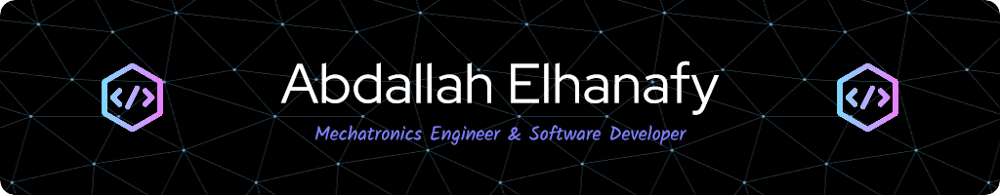

# 💫 About Me:
A highly A highly motivated Mechatronics Engineer , and a Software Developer. Driven by a strong passion for Web & Mobile Development.  🚀 Here's a bit more about me:  - 🔧 I have a solid foundation in engineering principles, which enables me to approach problems     with a systematic and analytical mindset. - 🌟 I thrive on staying up-to-date with cutting-edge technologies,      as I believe that staying ahead of the curve is essential in the ever-evolving tech world. - ⚡I'm currently publishing my app Bookish on the Google Play Store!  - 🌱 I’m currently learning the MERN Stack.  

## 🌐 Socials:

# 💻 Tech Stack:

                   

# 📊 GitHub Stats:

 

 

## 🏆 GitHub Trophies

### ✍️ Random Dev Quote

---

